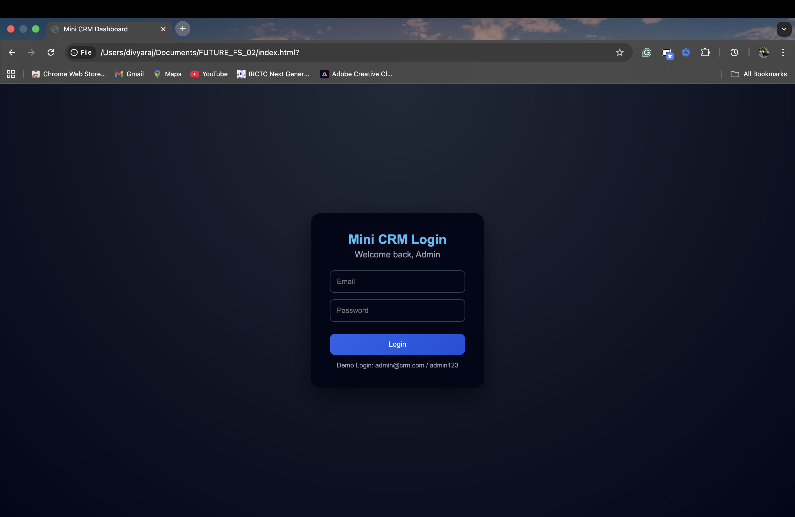
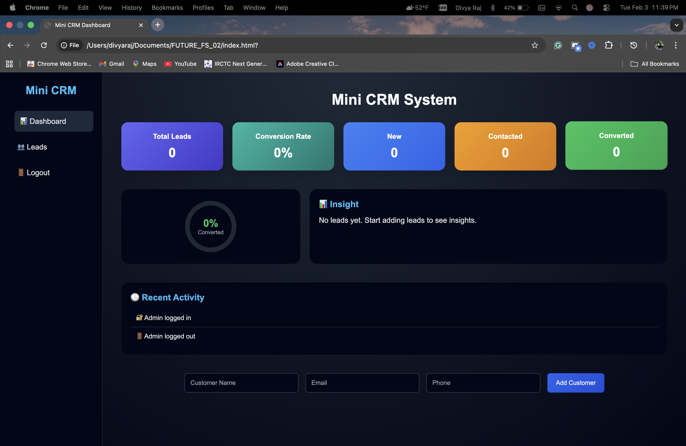
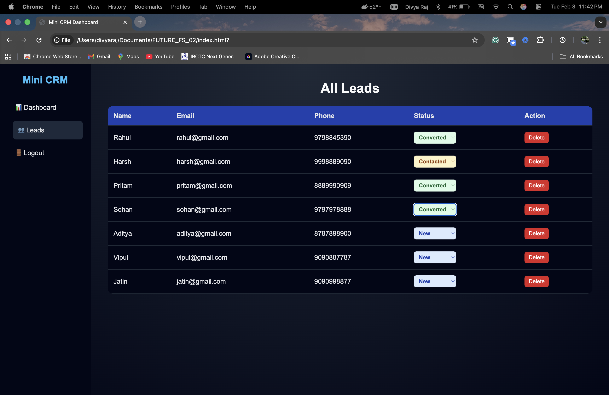
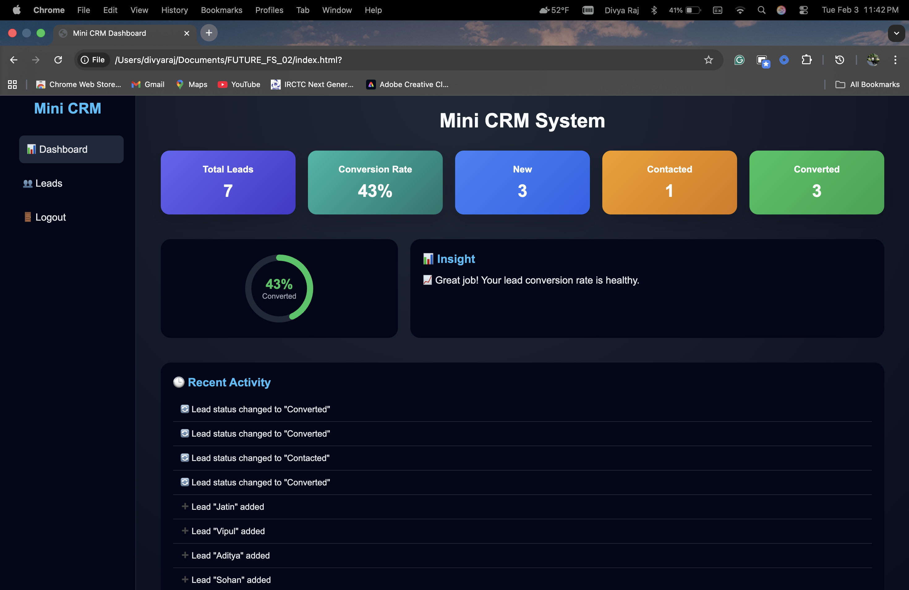

# Mini CRM Admin Dashboard

A modern, interactive Mini CRM Admin Dashboard built using pure **HTML, CSS, and JavaScript**.  
This project focuses on frontend architecture, UI/UX design, and business-oriented data visualization.

---

## 🚀 Features

- 🔐 Demo Login & Logout (Frontend authentication using `localStorage`)
- 📊 Dashboard analytics (Total Leads, Status-wise counts, Conversion Rate)
- 🔄 Lead lifecycle management (New → Contacted → Converted)
- 🟢 Conversion Ring (Custom circular progress – no chart library used)
- 💡 Smart Insight Box (Business logic-based suggestions)
- 🕒 Recent Activity Panel (Real-time activity logs)
- 🎨 Dark Mode UI with Sidebar Navigation
- ✨ Smooth animations and modern admin dashboard layout

---

## 🛠️ Technologies Used

- HTML  
- CSS  
- JavaScript  

---

## 🔑 Demo Login Credentials

Email: admin@crm.com

Password: admin123

---

## 📂 Project Structure

FUTURE_FS_02/
│
├── index.html
├── style.css
├── script.js
└── README.md

---
## 📸 Screenshots

### 🔐 Login Page

### 📊 Dashboard Overview

### 👥 Leads Management

### 📈 Insights & Conversion Ring

## 📌 Description

This Mini CRM Dashboard allows users to manage leads efficiently while visualizing conversion performance.

Instead of using common chart libraries, the project implements a **custom conversion ring and insight system**, making it unique, original, and non-copy.

The primary focus of this project is **product thinking**, **UX clarity**, and **frontend logic**, rather than backend complexity.

---

## 👤 Author

**Divya Raj**
🌐 **Live Demo:** https://divyaraj0001-design.github.io/FUTURE_FS_02/

